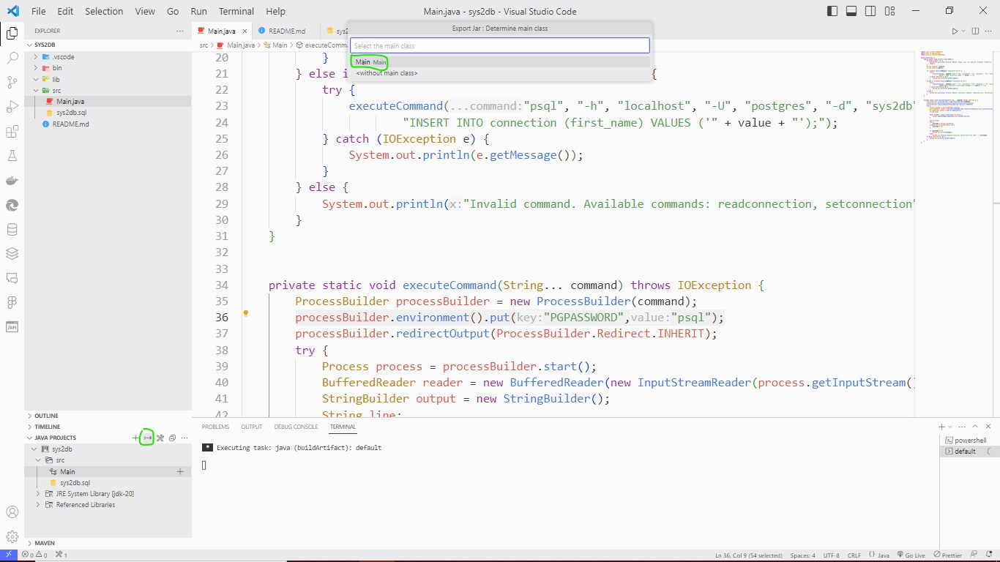

## Getting Started

Welcome! Here is a guideline to help you to do a simple `CLI(COMMAND LINE INTERFACE)` with java


## All steps

- First, clone this repository.
- Run the SQL script in postgreSQL to test later
- Then, change the password of postgreSQL in the `Main.java` according to yours
```sh
processBuilder.environment().put("PGPASSWORD",<your_password>);
```
- After that, click the little icon in `JAVA PROJECTS` to export the jar and then choose `Main` for the main class

- Finally, open a terminal in your computer and run the next command line

```sh
java -jar sys2db.jar <arguments>;
```
> if you use Windows as Operating System, add to command line `--enable-preview`
```sh
java --enable-preview -jar sys2db.jar <arguments>;
```
## Features

This CLI is just a simple app for interacting with a database including two features:
- select elements in the table with line limit
you can use the command next:
```sh
java -jar sys2db.jar readconnection <limit>
```

- insert new elements in the table
- select elements in the table with line limit
you can use the command next:
```sh
java -jar sys2db.jar newconnection <first_name>
```
